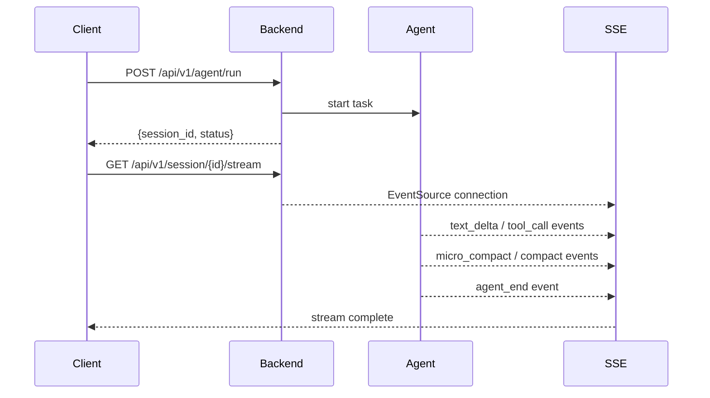

# API Documentation

## Backend API (Python — Port 8000)

### Agent



| Endpoint | Method | Description |
| :--- | :--- | :--- |
| `/api/v1/agent/run` | POST | Start an agent run |
| `/api/v1/agent/stop` | POST | Stop a running agent |

**Request Body** (`/agent/run`):
```json
{
  "session_id": "sess-abc123",
  "prompt": "Fix the null pointer in login()"
}
```

### Session

| Endpoint | Method | Description |
| :--- | :--- | :--- |
| `/api/v1/session/create` | POST | Create new session |
| `/api/v1/session/{id}/stream` | GET | SSE stream for session |
| `/api/v1/session/{id}/checkpoint` | POST | Create checkpoint |
| `/api/v1/session/{id}/rollback` | POST | Rollback to checkpoint |

### Configuration

| Endpoint | Method | Description |
| :--- | :--- | :--- |
| `/api/v1/config` | GET | Get all config values |
| `/api/v1/config` | PUT | Update config overrides |
| `/api/v1/config/reset` | POST | Reset to defaults |

**Response** (`GET /api/v1/config`):
```json
{
  "agent_max_turns": 50,
  "agent_water_level_threshold": 0.8,
  "agent_offload_threshold_bytes": 20000,
  "stormbreaker_max_consecutive_errors": 3,
  "microcompact_ttl_seconds": 300,
  "microcompact_keep_recent": 5,
  "autoplan_heuristic_threshold": 2,
  "autoplan_classifier_timeout_sec": 3,
  "tool_max_concurrent_reads": 8,
  "session_token_budget": 128000
}
```

### WebSocket

| Endpoint | Method | Description |
| :--- | :--- | :--- |
| `/api/v1/ws/permission/{session_id}` | WS | Tool permission confirmations |

**Client → Server**:
```json
{ "action": "allow", "id": "tc-xxx" }
```

**Server → Client**:
```json
{ "type": "permission_request", "id": "tc-xxx", "name": "edit", "arguments": {} }
```

### Health

| Endpoint | Method | Description |
| :--- | :--- | :--- |
| `/health` | GET | Health check |

### Workspace

| Endpoint | Method | Description |
| :--- | :--- | :--- |
| `/api/v1/workspace` | GET | Get current workspace (or null) |
| `/api/v1/workspace` | PUT | Open a workspace at given path |
| `/api/v1/workspace` | DELETE | Close current workspace |
| `/api/v1/workspace/recent` | GET | List recently opened workspaces |
| `/api/v1/workspace/validate` | POST | Validate whether a path is a valid workspace directory |
| `/api/v1/workspace/switch` | POST | Switch to another workspace |

**Request** (`PUT /api/v1/workspace`):
```json
{ "path": "/home/user/projects/my-app" }
```

**Response**:
```json
{
  "path": "/home/user/projects/my-app",
  "name": "my-app",
  "opened_at": "2026-06-20T12:00:00Z"
}
```

### Shutdown

| Endpoint | Method | Description |
| :--- | :--- | :--- |
| `/api/v1/shutdown` | POST | Gracefully stop the backend server |

The frontend displays a shutdown button in the nav bar. Clicking it calls this endpoint,
then shows a "Shutting down..." overlay. On the terminal side, `.\run.ps1 stop` handles
stopping all background services cleanly using saved PID files.

---

## Compute Node API (Rust — Port 8080)

### CodeGraph Endpoints

| Endpoint | Method | Description |
| :--- | :--- | :--- |
| `/graph/index` | POST | Index a project directory |
| `/graph/explore` | POST | One-click context exploration |
| `/graph/callers` | POST | Find callers of a symbol |
| `/graph/impact` | POST | RWR impact radius analysis |

**Request** (`/graph/explore`):
```json
{ "symbol": "UserService", "depth": 5 }
```

**Response**:
```json
{
  "context": "...source context...",
  "related": ["UserController", "UserRepository"]
}
```

### Compression Endpoints

| Endpoint | Method | Description |
| :--- | :--- | :--- |
| `/compress/crush` | POST | SmartCrusher JSON/text compression |

**Request**:
```json
{ "content": "[...large JSON...]", "query": "error" }
```

**Response**:
```json
{
  "compressed": "[sampled items...]",
  "saved_ratio": 0.95
}
```

## SSE Events

### Text Streaming

| Event Type | Payload | Description |
| :--- | :--- | :--- |
| `text_delta` | `{id, text, agent}` | Incremental text output |
| `text_done` | `{id, agent}` | Text segment completed |

### Tool Lifecycle

| Event Type | Payload | Description |
| :--- | :--- | :--- |
| `tool_call` | `{id, name, arguments, agent}` | Tool invocation |
| `tool_exec_start` | `{tool_calls: N, agent}` | Parallel execution started |
| `tool_exec_end` | `{results: N, agent}` | Execution finished |
| `tool_result` | `{id, result, agent}` | Individual result |

### Agent Lifecycle

| Event Type | Payload | Description |
| :--- | :--- | :--- |
| `agent_start` | `{session_id, input, agent}` | Agent run started |
| `agent_end` | `{turns: N, agent}` | Agent run completed |
| `agent_status` | `{status, agent}` | Status update |

### Planning

| Event Type | Payload | Description |
| :--- | :--- | :--- |
| `plan_start` | `{input, agent}` | AutoPlan triggered |
| `plan_step` | `{step: N, description, agent}` | Individual plan step |
| `plan_done` | `{steps: N, agent}` | Plan completed |

### Compression

| Event Type | Payload | Description |
| :--- | :--- | :--- |
| `compact_start` | `{agent}` | Full compaction started |
| `compact_end` | `{agent}` | Full compaction completed |
| `micro_compact` | `{compacted: N, agent}` | Micro-compaction completed |

### Usage & Metrics

| Event Type | Payload | Description |
| :--- | :--- | :--- |
| `usage` | `{saved_ratio, strategy, agent}` | Compression savings |
| `cache_metric` | `{fingerprint, hit, agent}` | Cache hit/miss |
| `status` | `{turn: N, agent}` | Turn status |

### Error & Permission

| Event Type | Payload | Description |
| :--- | :--- | :--- |
| `error` | `{message, agent}` | Error event |
| `interrupt` | `{reason, agent}` | User interrupt |
| `permission_request` | `{id, name, arguments}` | Tool permission prompt |
| `permission_result` | `{id, allowed}` | Permission response |

### Background Tasks

| Event Type | Payload | Description |
| :--- | :--- | :--- |
| `background_start` | `{task_id, agent}` | Background task started |
| `background_end` | `{task_id, result, agent}` | Background task completed |

### Sub-Agent

| Event Type | Payload | Description |
| :--- | :--- | :--- |
| `sub_agent_spawn` | `{name, agent}` | Sub-agent forked |
| `sub_agent_result` | `{name, result, agent}` | Sub-agent result returned |

> All events include a `source` field set to the agent name (e.g., `"main"` or `"explore"`),
> automatically injected by [AgentEmitter](../backend/app/core/emitter.py).
> Subscribers can filter by kind: `bus.subscribe("session-1", kind="text_delta")`.
