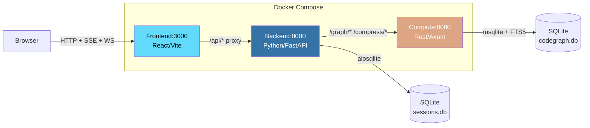
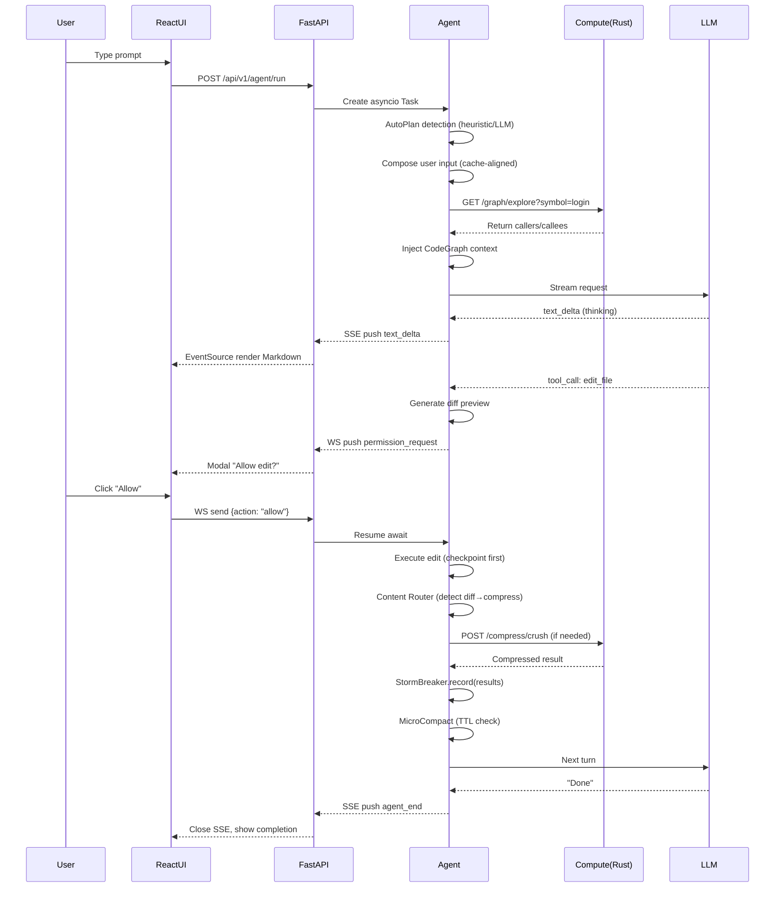
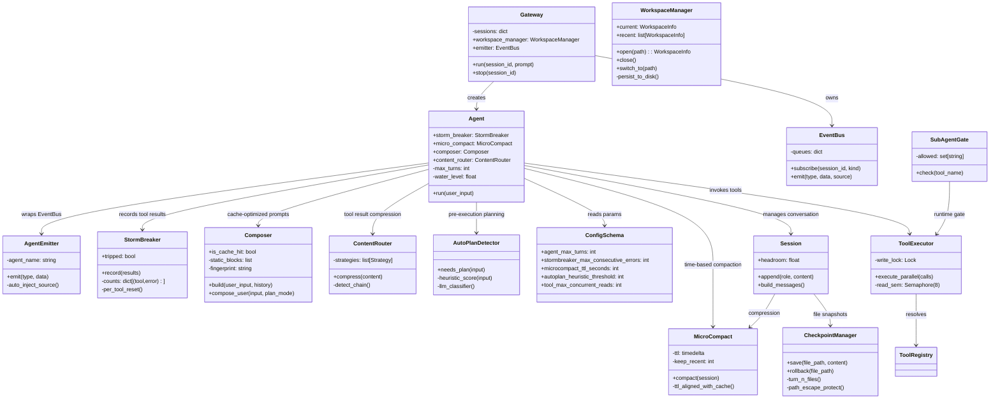
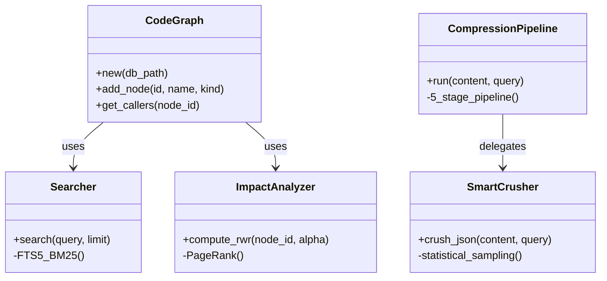
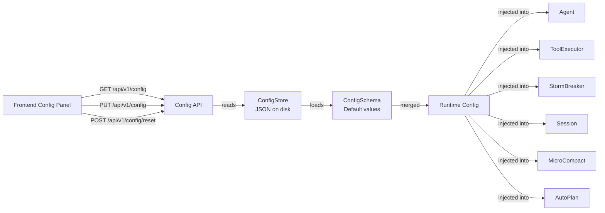

# Architecture

## Physical Deployment (3 Processes)

## End-to-End Data Flow

## Component Responsibilities

### Backend (Python)

### Compute Node (Rust)

## Config System

## Key Design Patterns

| Pattern | Module | Description |
| :--- | :--- | :--- |
| **MicroCompact** | `session/microcompact.py` | Time-aware compression aligned with Anthropic's 5-min prompt cache TTL |
| **Compose** | `llm/composer.py` | Cache-optimized prompt: system prompt stays static, variable content decorates user message tail |
| **StormBreaker** | `core/stormbreaker.py` | Per-tool `(name, error)` key tracking; success resets only its own tool's counter |
| **Content Router** | `headroom/router.py` | Detector chain (Diff→Code→Log→Search→Command→Text) routes content to optimal compressor |
| **AutoPlan** | `autoplan/detector.py` | Two-stage: cheap heuristic scoring (0-4), LLM classifier only for borderline cases (3s timeout) |
| **Workspace** | `workspace/__init__.py` | Tracks current & recent workspace directories; persists to disk; API-first |
| **Shutdown** | `main.py` + `run.ps1` | Dual-path: backend `/api/v1/shutdown` endpoint + `.\run.ps1 stop` with PID file tracking |
| **AgentEmitter** | `core/emitter.py` | Auto-injects `source` field into events; `subscribe(kind)` for kind-based filtering |
| **SubAgentGate** | `agentdef/loader.py` | Runtime tool access gate — doesn't alter tool list, denies at execution time to preserve cache |
| **Checkpoint** | `session/checkpoint.py` | Per-turn independent JSON files (`turn-N.json`), path-escape protection, idempotent restore |
