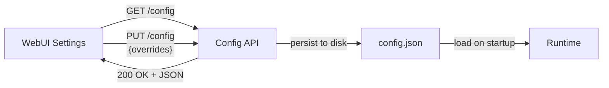

# Configuration Reference

All configurable parameters are declared in `backend/app/config/schema.py` and exposed via the Config API (`GET/PUT /api/v1/config`).

## Editor View

Values can be edited in real-time via the WebUI **Settings** panel or the Config API.



## Parameter Reference

### Agent

| Parameter | Type | Default | Description |
| :--- | :--- | :--- | :--- |
| `agent_max_turns` | int | 50 | Maximum agent loop iterations |
| `agent_water_level_threshold` | float | 0.8 | Session fullness ratio to trigger compaction |
| `agent_offload_threshold_bytes` | int | 20000 | Large result offload threshold |

### LLM / Provider

| Parameter | Type | Default | Description |
| :--- | :--- | :--- | :--- |
| `llm_deepseek_prompt_cache_block_size` | int | 128 | DeepSeek cache block alignment |
| `llm_warmup_threshold_chars` | int | 5000 | Large injection detection for cache warmup |
| `llm_warmup_prefill_tokens` | int | 2 | Cache warmup prefill token count |
| `llm_short_prompt_threshold_chars` | int | 2000 | Router short/fast prompt threshold |

### Tool Executor

| Parameter | Type | Default | Description |
| :--- | :--- | :--- | :--- |
| `tool_max_concurrent_reads` | int | 8 | Read tool concurrency limit |
| `tool_shell_default_timeout_sec` | int | 30 | Default shell command timeout |

### Session / Compactor

| Parameter | Type | Default | Description |
| :--- | :--- | :--- | :--- |
| `session_token_budget` | int | 128000 | Token budget before compaction |
| `session_tokens_per_char` | int | 4 | Estimated tokens per character |
| `session_soft_limit_bytes` | int | 100000 | Session headroom calculation base |

### MicroCompact

| Parameter | Type | Default | Description |
| :--- | :--- | :--- | :--- |
| `microcompact_ttl_seconds` | int | 300 | Cache TTL alignment (5 min = Anthropic prompt cache) |
| `microcompact_keep_recent` | int | 5 | Preserve last N assistant+tool entries from compaction |

### StormBreaker

| Parameter | Type | Default | Description |
| :--- | :--- | :--- | :--- |
| `stormbreaker_max_consecutive_errors` | int | 3 | Consecutive (tool,error) pairs before loop guard trips |

### AutoPlan

| Parameter | Type | Default | Description |
| :--- | :--- | :--- | :--- |
| `autoplan_heuristic_threshold` | int | 2 | Score >= triggers plan; 1-2 calls LLM classifier |
| `autoplan_classifier_timeout_sec` | int | 3 | LLM classifier timeout with fallback to heuristic |
| `autoplan_keywords` | string | "refactor,redesign,..." | Comma-separated heuristic keywords |

### Compute Node

| Parameter | Type | Default | Description |
| :--- | :--- | :--- | :--- |
| `compute_graph_explore_default_depth` | int | 5 | Default graph exploration depth |
| `compute_impact_rwr_alpha` | float | 0.25 | PageRank restart probability |
| `compute_impact_rwr_iterations` | int | 100 | PageRank iteration count |

### Frontend

| Parameter | Type | Default | Description |
| :--- | :--- | :--- | :--- |
| `frontend_message_max_width_pct` | int | 80 | Max message bubble width |
| `frontend_scroll_behavior` | string | "smooth" | Scroll animation behavior |

## API Examples

### Read current config
```bash
curl http://localhost:8000/api/v1/config
```

### Update a parameter
```bash
curl -X PUT http://localhost:8000/api/v1/config \
  -H "Content-Type: application/json" \
  -d '{"overrides": {"agent_max_turns": 100, "stormbreaker_max_consecutive_errors": 5}}'
```

### Reset to defaults
```bash
curl -X POST http://localhost:8000/api/v1/config/reset
```
