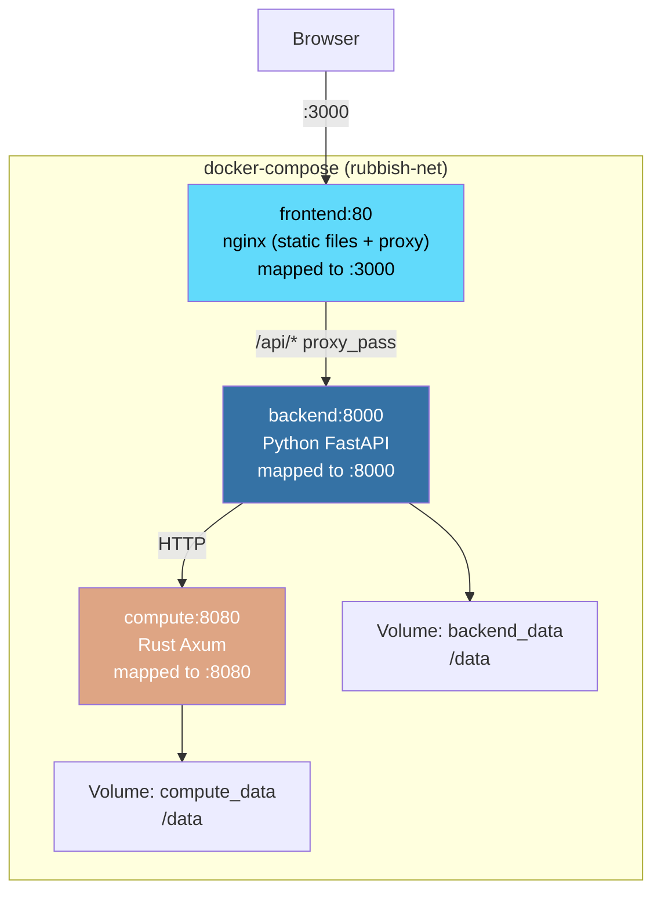

# Deployment

## Architecture



All three services run inside a dedicated bridge network (`rubbish-net`) and communicate
via Docker service names (`backend`, `compute`, `frontend`). Only the mapped ports are exposed
to the host.

## Prerequisites

- Docker 24+
- Docker Compose v2 (included with Docker Desktop)

## Quick Start

```bash
# 1. Clone and enter the project
cd rubbish

# 2. Copy the Docker environment template and configure
cp .env.docker .env
# Edit .env — at minimum set LLM_API_KEY

# 3. Build and start all services
docker compose up --build -d

# 4. Open the WebUI
open http://localhost:3000

# 5. View logs
docker compose logs -f

# 6. Stop everything
docker compose down
```

## Service Details

### Backend (`backend:8000` → host `:8000`)

- Python FastAPI with uvicorn
- Listens on port **8000** internally
- Reads configuration from `.env` file and `LLM_API_KEY` environment variable
- Connects to compute node at `http://compute:8080`
- Persists data to the `backend_data` volume at `/data`:
  - Session checkpoints
  - Config overrides (`config.json`)
  - Offloaded large results
- Health check: every 30s, `GET /health`, 15s start period

### Compute Node (`compute:8080` → host `:8080`)

- Rust Axum microservice
- Listens on port **8080** internally
- Stores CodeGraph data in `/data/codegraph.db` on `compute_data` volume
- Health check: every 30s, `GET /health`, 15s start period

### Frontend (`frontend:80` → host `:3000`)

- React SPA built to static files, served by **nginx**
- Listens on port **80** internally, mapped to host port **3000**
- Nginx proxies all `/api/*` requests to `http://backend:8000/api/`
- Supports **WebSocket** (tool permission dialogs) and **SSE** (streaming responses)
- SPA fallback: all non-API routes serve `index.html`
- Waits for backend health check to pass before starting

## Environment Variables

Copy `.env.docker` to `.env` and configure:

| Variable | Default | Required | Description |
| :--- | :--- | :--- | :--- |
| `LLM_API_KEY` | — | **Yes** | LLM provider API key |
| `LLM_BASE_URL` | `https://api.deepseek.com` | No | LLM API base URL |
| `LLM_MODEL` | `deepseek-chat` | No | Model name |
| `LLM_PROVIDER` | `openai` | No | Provider type (`openai` / `anthropic`) |
| `BACKEND_PORT` | `8000` | No | Host port for backend |
| `COMPUTE_PORT` | `8080` | No | Host port for compute node |
| `FRONTEND_PORT` | `3000` | No | Host port for frontend |

Additional backend settings (optional):

| Variable | Default | Description |
| :--- | :--- | :--- |
| `AGENT_MAX_TURNS` | `50` | Maximum agent loop iterations |
| `TOOL_SHELL_TIMEOUT` | `30` | Shell command timeout in seconds |
| `LOG_LEVEL` | `INFO` | Logging level |

## Data Persistence

Two named Docker volumes store persistent data:

```
backend_data:/data/
├── config.json              # Config overrides (set via WebUI / API)
├── offload/                 # Offloaded large tool results
│   ├── abc123.json
│   └── def456.json
└── .sessions/               # Session checkpoints (created by CheckpointManager)

compute_data:/data/
└── codegraph.db             # CodeGraph SQLite (nodes, edges, FTS5 index)
```

To inspect or back up volumes:

```bash
# List volumes
docker volume ls | grep rubbish

# Inspect volume mount point (Docker Desktop)
docker volume inspect rubbish_backend_data

# Backup
docker run --rm -v rubbish_backend_data:/data -v .:/backup alpine \
    tar czf /backup/backend-data.tar.gz -C /data .
```

## Health Checks

All services include Docker health checks:

| Service | Command | Interval | Start Period | Retries |
| :--- | :--- | :--- | :--- | :--- |
| backend | `GET /health` via Python urllib | 30s | 15s | 3 |
| compute | `GET /health` via wget | 30s | 15s | 3 |
| frontend | depends on `backend: condition: service_healthy` | — | — | — |

The frontend container will not start until the backend passes its health check.

## Production Considerations

### Security

- The backend runs as a **non-root user** (`app`, UID 1001)
- The compute node imports minimal dependencies (no shell access)
- All three services share a dedicated bridge network — no unnecessary port exposure
- Sensitive values (`LLM_API_KEY`) are passed via `.env`, never baked into images

### Scaling

For production deployment:

```bash
# 1. Use a reverse proxy (e.g., Caddy / Traefik) in front of the stack
#    to handle TLS termination and domain routing

# 2. Pin specific image versions instead of building from source
docker compose build
docker tag rubbish-backend:latest registry.example.com/rubbish-backend:v1.0.0
docker push registry.example.com/rubbish-backend:v1.0.0
# Update docker-compose.yml to use the tagged image

# 3. Set up log rotation for Docker container logs

# 4. Schedule regular volume backups
```

### System Requirements

| Component | CPU | RAM | Disk |
| :--- | :--- | :--- | :--- |
| Backend | 1 core | 1 GB | 1 GB |
| Compute | 2 cores | 2 GB | 5 GB |
| Frontend | 1 core | 512 MB | 500 MB |

## Troubleshooting

```bash
# Check container status
docker compose ps

# View logs for a specific service
docker compose logs backend
docker compose logs -f compute

# Rebuild from scratch (no cache)
docker compose build --no-cache

# Reset all data (⚠️ deletes volumes)
docker compose down -v
```
