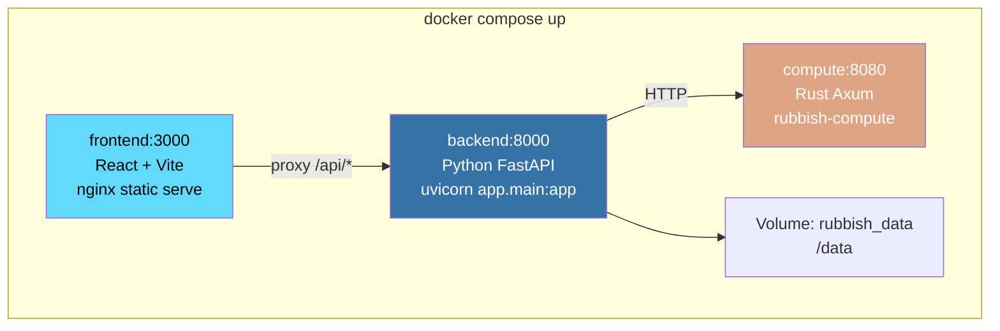
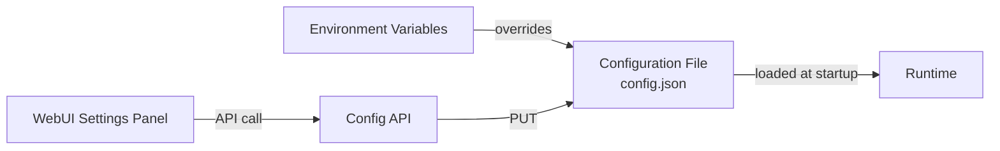

# Deployment

## Docker Compose (Development)



```bash
# Start all services
docker compose up -d --build

# Check logs
docker compose logs -f

# Stop
docker compose down
```

## Production Build

```bash
# Build images
docker compose build

# Tag and push
docker tag rubbish-backend:latest registry.example.com/rubbish-backend:latest
docker tag rubbish-compute:latest registry.example.com/rubbish-compute:latest
docker tag rubbish-webui:latest registry.example.com/rubbish-webui:latest
```

## Configuration

All runtime parameters are exposed via the config API at `/api/v1/config`.



### Environment Variables

| Variable | Default | Description |
| :--- | :--- | :--- |
| `DATABASE_URL` | `sqlite+aiosqlite:///data/rubbish.db` | Backend database |
| `COMPUTE_NODE_URL` | `http://compute:8080` | Rust compute node address |
| `COMPUTE_DB_PATH` | `./data/codegraph.db` | Compute node SQLite database path (`:memory:` for testing) |
| `COMPUTE_PORT` | `8080` | Compute node HTTP listen port |
| `LOG_LEVEL` | `INFO` | Logging level |

## Data Persistence

```
/data/
├── rubbish.db            # Main SQLite (sessions, checkpoints)
├── config.json            # Config overrides
├── offload/               # Offloaded large results
│   ├── abc123.json
│   └── def456.json
└── compute/
    └── codegraph.db       # CodeGraph SQLite (nodes, edges, FTS5)
```

## System Requirements

| Component | CPU | RAM | Disk |
| :--- | :--- | :--- | :--- |
| Backend | 1 core | 1 GB | 1 GB |
| Compute | 2 cores | 2 GB | 5 GB |
| Frontend | 1 core | 512 MB | 500 MB |
