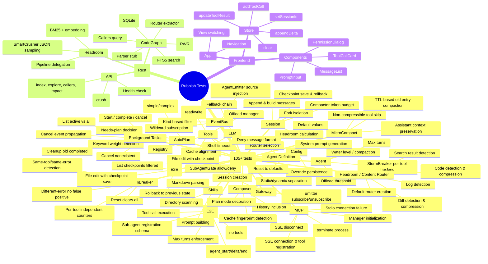

# Development Guide

## Prerequisites

- Python 3.11+
- Rust 1.77+
- Node.js 20+
- Docker & Docker Compose (optional)

## Quick Start

```powershell
# Single command: start all 3 services (backend + compute + frontend)
.\run.ps1 all -Install

# Or start individually:
.\run.ps1 backend
.\run.ps1 compute
.\run.ps1 frontend

# Stop all background services gracefully:
.\run.ps1 stop

# Run all unit tests:
.\runtests.ps1

# Run integration tests (requires compute-node binary built):
.\runtests.ps1 -Integration
```

## Service Lifecycle

### Starting

Use `.\run.ps1 all` to start all three services in background (silent) mode.
Each service's PID is saved to `run/<name>.pid` for later cleanup.

Use `.\run.ps1 all -Dev` to open three separate terminal windows — useful for
seeing live logs per service. PIDs are still tracked, so `.\run.ps1 stop` works here too.

### Stopping

Run `.\run.ps1 stop` to gracefully stop all background services in reverse
start order (frontend → backend → compute):

1. Reads each PID from `run/<name>.pid`
2. Sends `Stop-Process` (WM_CLOSE on Windows) for graceful shutdown
3. Waits up to 5 seconds for process to exit
4. Force-kills if still running
5. Cleans up PID files

You can also shut down the backend from the WebUI by clicking the power icon
(⚡) in the top-right nav bar, which calls `POST /api/v1/shutdown`.

## Service Development

### 1. Backend

```bash
cd backend
python -m venv .venv
.venv\Scripts\activate   # Windows
pip install -e .

# Run tests
pytest tests/ -v

# Run with coverage
pytest tests/ --cov=app --cov-report=term-missing

# Start development server
uvicorn app.main:app --reload --port 8000
```

### 2. Compute Node

```bash
cd compute-node

# Build
cargo build

# Run tests
cargo test

# Start (SQLite persists to ./data/codegraph.db by default)
cargo run

# Customize database path
$env:COMPUTE_DB_PATH = "./my_data/graph.db"
cargo run
```

### 3. Frontend

```bash
cd frontend
npm install

# Run tests
npm test

# Start dev server (with API proxy to backend)
npm run dev
```

## Unified Test Runner

Use the [`runtests.ps1`](../runtests.ps1) script for a single-command entry to all test suites:

```powershell
.\runtests.ps1                  # Run all unit tests: backend + compute-node + frontend
.\runtests.ps1 -Module backend  # Only backend (pytest)
.\runtests.ps1 -Module compute-node  # Only Rust (cargo test)
.\runtests.ps1 -Module frontend # Only frontend (vitest)
```

## Integration Tests

Integration tests verify the Python ↔ Rust HTTP communication end-to-end. They start the actual Rust compute node binary as a subprocess and make real HTTP requests.

**Prerequisites:**
```bash
cd compute-node
cargo build   # Build the Rust binary first
```

**Run:**
```powershell
.\runtests.ps1 -Integration
# Or directly:
pytest backend/tests/test_integration_compute.py -v --timeout=60
```

**What's tested:**
- Health check endpoint
- Project indexing (`/graph/index`)
- Symbol exploration (`/graph/explore`)
- Caller queries (`/graph/callers`)
- JSON compression (`/compress/crush`)
- Text compression
- Impact radius (`/graph/impact`)
- Database persistence (data survives across requests)

> Tests use a temporary SQLite database and a non-standard port (18080) to avoid conflicts.

## Test Coverage



## Code Style

- **Python**: Follow PEP 8, use `ruff` for linting
- **Rust**: Follow `rustfmt` defaults
- **TypeScript**: Use strict mode, `prettier` for formatting

## Adding a New Configurable Parameter

1. Add the field to [`schema.py`](../backend/app/config/schema.py)
2. Use it in the module via `from app.config import config` → `config.my_new_param`
3. The value is automatically exposed via the Config API and Panel
4. Document in [`CONFIG.md`](CONFIG.md)

## Architecture Principles

1. **Never use PyO3** — Rust runs as a separate HTTP microservice
2. **Configuration over magic numbers** — All tunable parameters exposed via ConfigSchema/API
3. **SSE for streaming, WebSocket for bidirectional** — Clear separation of concerns
4. **Read/Write partitioning** — Read tools run in parallel (Semaphore), writes serialized (Lock)
5. **Cache-Everything** — Compose system aligns system prompt bytes for maximum cache hit ratio
