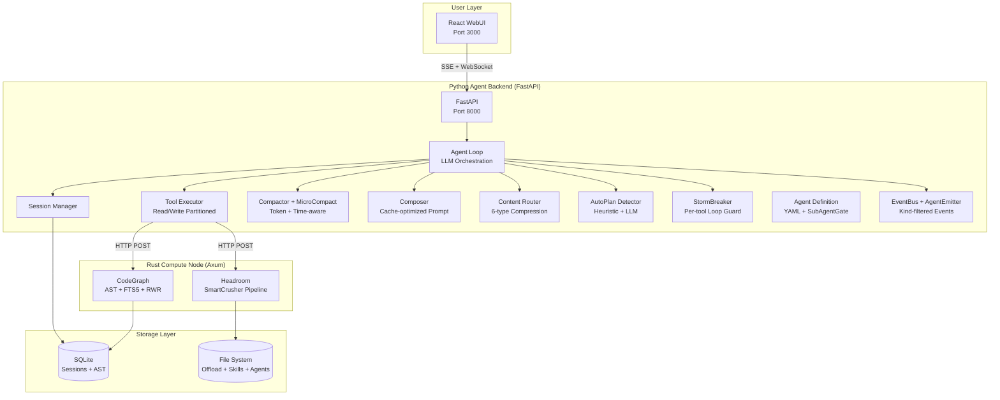

# Rubbish

> **Agent-driven code intelligence engine** — Python orchestrator + Rust compute + React WebUI.

Rubbish is a full-stack, multi-process agent platform that combines LLM orchestration (Python/FastAPI), computation-intensive code analysis (Rust/Axum), and a modern web interface (React/Vite).

---

## Quick Start

```bash
# Option A: Full stack via Docker
docker compose up -d
open http://localhost:3000

# Option B: Individual services (development)
.\run.ps1 backend       # FastAPI on :8000
.\run.ps1 frontend      # Vite on :5173
.\run.ps1 compute       # Rust on :8080
.\run.ps1 all           # backend + compute + frontend in background
.\run.ps1 all -Dev      # same, but in separate terminal windows
.\run.ps1 stop          # gracefully stop all background services
```

## Architecture Overview



## Project Structure

```
rubbish/
├── backend/              # Python FastAPI — agent orchestration
│   ├── app/
│   │   ├── core/         # Agent, Gateway, StormBreaker, EventBus
│   │   ├── llm/          # LLM providers, Composer, Fallback
│   │   ├── session/      # Session, Compactor, MicroCompact, Checkpoint
│   │   ├── tools/        # Tool registry, executor, builtin tools, offload
│   │   ├── headroom/     # Content Router (6-type compression)
│   │   ├── autoplan/     # Heuristic + LLM planning detection
│   │   ├── agentdef/     # Agent definition system + SubAgentGate
│   │   ├── workspace/    # Workspace manager (open/close/switch/recent)
│   │   ├── config/       # ConfigSchema (centralized)
│   │   ├── api/          # REST routes + WebSocket
│   │   └── skills/       # Skill loader
│   └── tests/            # 76+ pytest tests
├── compute-node/         # Rust Axum — code analysis & compression
├── frontend/             # React + Vite — WebUI
├── docs/                 # Documentation
├── run.ps1               # Unified run entry point
└── runtests.ps1          # Unified test runner
```

## Scripts

| Script | Purpose | Examples |
| :--- | :--- | :--- |
| [`run.ps1`](../run.ps1) | Start/stop services | `.\run.ps1 backend`, `.\run.ps1 all -Install`, `.\run.ps1 stop` |
| [`runtests.ps1`](../runtests.ps1) | Run all/module tests | `.\runtests.ps1`, `.\runtests.ps1 -Module backend` |

## License

MIT
