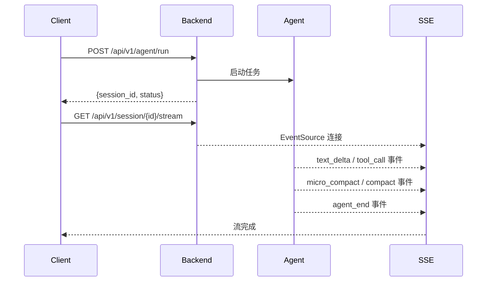

# API 文档

## 后端 API（Python — 端口 8000）

### 代理（Agent）



| 端点 | 方法 | 描述 |
| :--- | :--- | :--- |
| `/api/v1/agent/run` | POST | 启动代理运行 |
| `/api/v1/agent/stop` | POST | 停止正在运行的代理 |

**请求体**（`/agent/run`）：
```json
{
  "session_id": "sess-abc123",
  "prompt": "修复 login() 中的空指针"
}
```

### 会话（Session）

| 端点 | 方法 | 描述 |
| :--- | :--- | :--- |
| `/api/v1/session/create` | POST | 创建新会话 |
| `/api/v1/session/{id}/stream` | GET | 会话的 SSE 流 |
| `/api/v1/session/{id}/checkpoint` | POST | 创建检查点 |
| `/api/v1/session/{id}/rollback` | POST | 回滚到检查点 |

### 配置（Configuration）

| 端点 | 方法 | 描述 |
| :--- | :--- | :--- |
| `/api/v1/config` | GET | 获取所有配置值 |
| `/api/v1/config` | PUT | 更新配置覆盖 |
| `/api/v1/config/reset` | POST | 重置为默认值 |

**响应**（`GET /api/v1/config`）：
```json
{
  "agent_max_turns": 50,
  "agent_water_level_threshold": 0.8,
  "agent_offload_threshold_bytes": 20000,
  "stormbreaker_max_consecutive_errors": 3,
  "microcompact_ttl_seconds": 300,
  "microcompact_keep_recent": 5,
  "autoplan_heuristic_threshold": 2,
  "autoplan_classifier_timeout_sec": 3,
  "tool_max_concurrent_reads": 8,
  "session_token_budget": 128000
}
```

### WebSocket

| 端点 | 方法 | 描述 |
| :--- | :--- | :--- |
| `/api/v1/ws/permission/{session_id}` | WS | 工具权限确认 |

**客户端 → 服务器**：
```json
{ "action": "allow", "id": "tc-xxx" }
```

**服务器 → 客户端**：
```json
{ "type": "permission_request", "id": "tc-xxx", "name": "edit", "arguments": {} }
```

### 健康检查

| 端点 | 方法 | 描述 |
| :--- | :--- | :--- |
| `/health` | GET | 健康检查 |

### 工作区（Workspace）

| 端点 | 方法 | 描述 |
| :--- | :--- | :--- |
| `/api/v1/workspace` | GET | 获取当前工作区（或 null） |
| `/api/v1/workspace` | PUT | 打开指定路径的工作区 |
| `/api/v1/workspace` | DELETE | 关闭当前工作区 |
| `/api/v1/workspace/recent` | GET | 列出最近打开的工作区 |
| `/api/v1/workspace/validate` | POST | 验证路径是否为有效的工作区目录 |
| `/api/v1/workspace/switch` | POST | 切换到另一个工作区 |

**请求**（`PUT /api/v1/workspace`）：
```json
{ "path": "/home/user/projects/my-app" }
```

**响应**：
```json
{
  "path": "/home/user/projects/my-app",
  "name": "my-app",
  "opened_at": "2026-06-20T12:00:00Z"
}
```

### 关闭（Shutdown）

| 端点 | 方法 | 描述 |
| :--- | :--- | :--- |
| `/api/v1/shutdown` | POST | 优雅停止后端服务器 |

前端在导航栏中显示关闭按钮。点击它将调用此端点，然后显示"正在关闭..."覆盖层。在终端侧，`.\run.ps1 stop` 使用保存的 PID 文件优雅地停止所有后台服务。

---

## 计算节点 API（Rust — 端口 8080）

### CodeGraph 端点

| 端点 | 方法 | 描述 |
| :--- | :--- | :--- |
| `/graph/index` | POST | 索引项目目录 |
| `/graph/explore` | POST | 一键上下文探索 |
| `/graph/callers` | POST | 查找符号的调用者 |
| `/graph/impact` | POST | RWR 影响半径分析 |

**请求**（`/graph/explore`）：
```json
{ "symbol": "UserService", "depth": 5 }
```

**响应**：
```json
{
  "context": "...源代码上下文...",
  "related": ["UserController", "UserRepository"]
}
```

### 压缩端点

| 端点 | 方法 | 描述 |
| :--- | :--- | :--- |
| `/compress/crush` | POST | SmartCrusher JSON/文本压缩 |

**请求**：
```json
{ "content": "[...大型 JSON...]", "query": "error" }
```

**响应**：
```json
{
  "compressed": "[采样项...]",
  "saved_ratio": 0.95
}
```

## SSE 事件

### 文本流

| 事件类型 | 负载 | 描述 |
| :--- | :--- | :--- |
| `text_delta` | `{id, text, agent}` | 增量文本输出 |
| `text_done` | `{id, agent}` | 文本段完成 |

### 工具生命周期

| 事件类型 | 负载 | 描述 |
| :--- | :--- | :--- |
| `tool_call` | `{id, name, arguments, agent}` | 工具调用 |
| `tool_exec_start` | `{tool_calls: N, agent}` | 并行执行开始 |
| `tool_exec_end` | `{results: N, agent}` | 执行完成 |
| `tool_result` | `{id, result, agent}` | 单个结果 |

### 代理生命周期

| 事件类型 | 负载 | 描述 |
| :--- | :--- | :--- |
| `agent_start` | `{session_id, input, agent}` | 代理运行开始 |
| `agent_end` | `{turns: N, agent}` | 代理运行完成 |
| `agent_status` | `{status, agent}` | 状态更新 |

### 规划

| 事件类型 | 负载 | 描述 |
| :--- | :--- | :--- |
| `plan_start` | `{input, agent}` | AutoPlan 触发 |
| `plan_step` | `{step: N, description, agent}` | 单个规划步骤 |
| `plan_done` | `{steps: N, agent}` | 规划完成 |

### 压缩

| 事件类型 | 负载 | 描述 |
| :--- | :--- | :--- |
| `compact_start` | `{agent}` | 完全压缩开始 |
| `compact_end` | `{agent}` | 完全压缩完成 |
| `micro_compact` | `{compacted: N, agent}` | 微压缩完成 |

### 用量与指标

| 事件类型 | 负载 | 描述 |
| :--- | :--- | :--- |
| `usage` | `{saved_ratio, strategy, agent}` | 压缩节省率 |
| `cache_metric` | `{fingerprint, hit, agent}` | 缓存命中/未命中 |
| `status` | `{turn: N, agent}` | 轮次状态 |

### 错误与权限

| 事件类型 | 负载 | 描述 |
| :--- | :--- | :--- |
| `error` | `{message, agent}` | 错误事件 |
| `interrupt` | `{reason, agent}` | 用户中断 |
| `permission_request` | `{id, name, arguments}` | 工具权限提示 |
| `permission_result` | `{id, allowed}` | 权限响应 |

### 后台任务

| 事件类型 | 负载 | 描述 |
| :--- | :--- | :--- |
| `background_start` | `{task_id, agent}` | 后台任务开始 |
| `background_end` | `{task_id, result, agent}` | 后台任务完成 |

### 子代理

| 事件类型 | 负载 | 描述 |
| :--- | :--- | :--- |
| `sub_agent_spawn` | `{name, agent}` | 子代理分支 |
| `sub_agent_result` | `{name, result, agent}` | 子代理结果返回 |

> 所有事件均包含由 [AgentEmitter](../backend/app/core/emitter.py) 自动注入的 `source` 字段（值为代理名称，如 `"main"` 或 `"explore"`）。
> 订阅者可以按类型过滤：`bus.subscribe("session-1", kind="text_delta")`。
