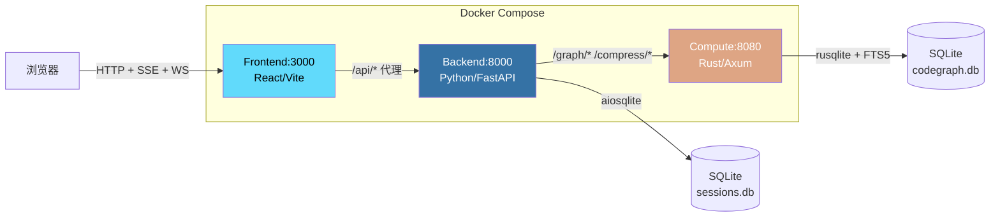
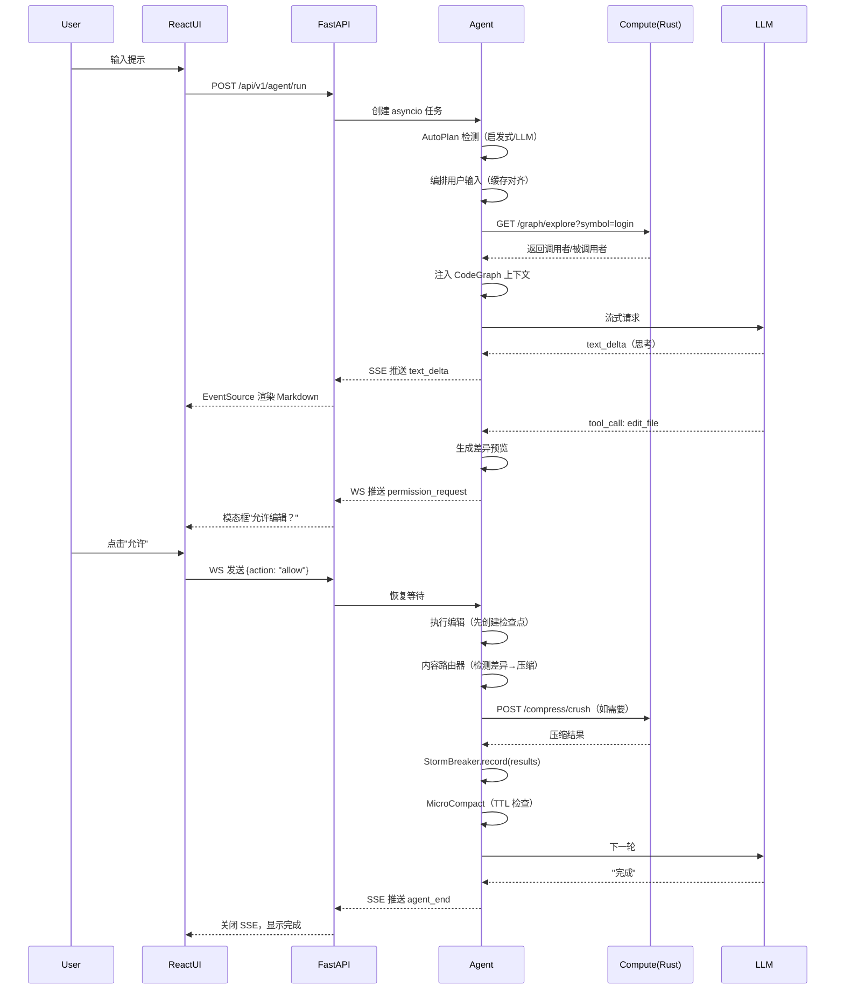
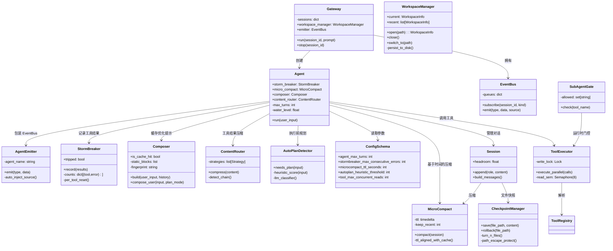
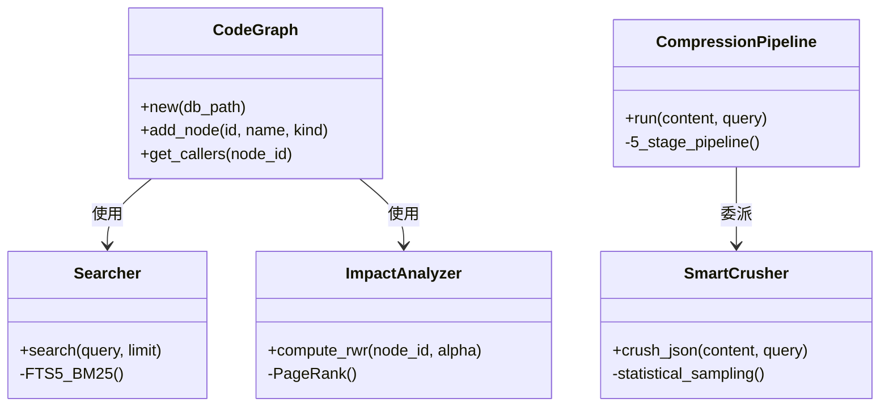
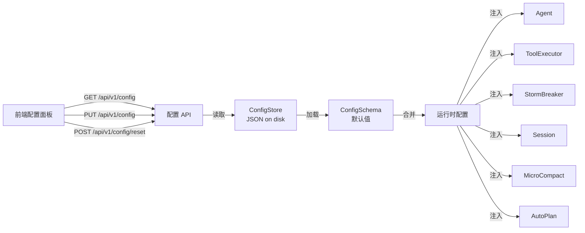

# 架构

## 物理部署（3 进程）

## 端到端数据流

## 组件职责

### 后端（Python）

### 计算节点（Rust）

## 配置系统

## 关键设计模式

| 模式 | 模块 | 描述 |
| :--- | :--- | :--- |
| **MicroCompact** | `session/microcompact.py` | 时间感知压缩，与 Anthropic 5 分钟提示缓存 TTL 对齐 |
| **Compose** | `llm/composer.py` | 缓存优化的提示：系统提示保持静态，可变内容装饰用户消息尾部 |
| **StormBreaker** | `core/stormbreaker.py` | 按工具的 `(名称, 错误)` 键追踪；成功仅重置自身计数器 |
| **Content Router** | `headroom/router.py` | 检测器链（Diff→Code→Log→Search→Command→Text）将内容路由到最优压缩器 |
| **AutoPlan** | `autoplan/detector.py` | 两阶段：低成本启发式评分（0-4），仅边界情况调用 LLM 分类器（3s 超时） |
| **Workspace** | `workspace/__init__.py` | 追踪当前和最近的工作区目录；持久化到磁盘；API 优先 |
| **Shutdown** | `main.py` + `run.ps1` | 双路径：后端 `/api/v1/shutdown` 端点 + `.\run.ps1 stop` 的 PID 文件追踪 |
| **AgentEmitter** | `core/emitter.py` | 自动向事件注入 `source` 字段；`subscribe(kind)` 支持按类型过滤 |
| **SubAgentGate** | `agentdef/loader.py` | 运行时工具访问门 — 不修改工具列表，在执行时拒绝以保持缓存 |
| **Checkpoint** | `session/checkpoint.py` | 每轮独立的 JSON 文件（`turn-N.json`），路径转义保护，幂等恢复 |
