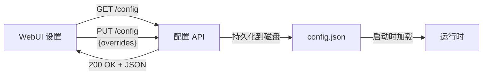

# 配置参考

所有可配置参数在 `backend/app/config/schema.py` 中声明，并通过配置 API（`GET/PUT /api/v1/config`）暴露。

## 编辑器视图

可以通过 WebUI **设置**面板或配置 API 实时编辑值。



## 参数参考

### 代理（Agent）

| 参数 | 类型 | 默认值 | 描述 |
| :--- | :--- | :--- | :--- |
| `agent_max_turns` | int | 50 | 代理循环最大迭代次数 |
| `agent_water_level_threshold` | float | 0.8 | 触发压缩的会话填充率阈值 |
| `agent_offload_threshold_bytes` | int | 20000 | 大结果卸载阈值 |

### LLM / 提供商

| 参数 | 类型 | 默认值 | 描述 |
| :--- | :--- | :--- | :--- |
| `llm_deepseek_prompt_cache_block_size` | int | 128 | DeepSeek 缓存块对齐 |
| `llm_warmup_threshold_chars` | int | 5000 | 大注入检测缓存预热 |
| `llm_warmup_prefill_tokens` | int | 2 | 缓存预热预填充令牌数 |
| `llm_short_prompt_threshold_chars` | int | 2000 | 路由器短/快速提示阈值 |

### 工具执行器（Tool Executor）

| 参数 | 类型 | 默认值 | 描述 |
| :--- | :--- | :--- | :--- |
| `tool_max_concurrent_reads` | int | 8 | 读取工具并发限制 |
| `tool_shell_default_timeout_sec` | int | 30 | Shell 命令默认超时 |

### 会话 / 压缩器（Session / Compactor）

| 参数 | 类型 | 默认值 | 描述 |
| :--- | :--- | :--- | :--- |
| `session_token_budget` | int | 128000 | 压缩前的令牌预算 |
| `session_tokens_per_char` | int | 4 | 每字符估计令牌数 |
| `session_soft_limit_bytes` | int | 100000 | 会话余量计算基数 |

### MicroCompact

| 参数 | 类型 | 默认值 | 描述 |
| :--- | :--- | :--- | :--- |
| `microcompact_ttl_seconds` | int | 300 | 缓存 TTL 对齐（5 分钟 = Anthropic 提示缓存） |
| `microcompact_keep_recent` | int | 5 | 保留最近 N 条助手+工具条目免于压缩 |

### StormBreaker

| 参数 | 类型 | 默认值 | 描述 |
| :--- | :--- | :--- | :--- |
| `stormbreaker_max_consecutive_errors` | int | 3 | 循环防护触发前的连续（工具,错误）对数 |

### AutoPlan

| 参数 | 类型 | 默认值 | 描述 |
| :--- | :--- | :--- | :--- |
| `autoplan_heuristic_threshold` | int | 2 | 评分 >= 触发规划；1-2 调用 LLM 分类器 |
| `autoplan_classifier_timeout_sec` | int | 3 | LLM 分类器超时，超时回退到启发式 |
| `autoplan_keywords` | string | "refactor,redesign,..." | 逗号分隔的启发式关键词 |

### 计算节点（Compute Node）

| 参数 | 类型 | 默认值 | 描述 |
| :--- | :--- | :--- | :--- |
| `compute_graph_explore_default_depth` | int | 5 | 默认图探索深度 |
| `compute_impact_rwr_alpha` | float | 0.25 | PageRank 重启概率 |
| `compute_impact_rwr_iterations` | int | 100 | PageRank 迭代次数 |

### 前端（Frontend）

| 参数 | 类型 | 默认值 | 描述 |
| :--- | :--- | :--- | :--- |
| `frontend_message_max_width_pct` | int | 80 | 消息气泡最大宽度 |
| `frontend_scroll_behavior` | string | "smooth" | 滚动动画行为 |

## API 示例

### 读取当前配置
```bash
curl http://localhost:8000/api/v1/config
```

### 更新参数
```bash
curl -X PUT http://localhost:8000/api/v1/config \
  -H "Content-Type: application/json" \
  -d '{"overrides": {"agent_max_turns": 100, "stormbreaker_max_consecutive_errors": 5}}'
```

### 重置为默认值
```bash
curl -X POST http://localhost:8000/api/v1/config/reset
```
