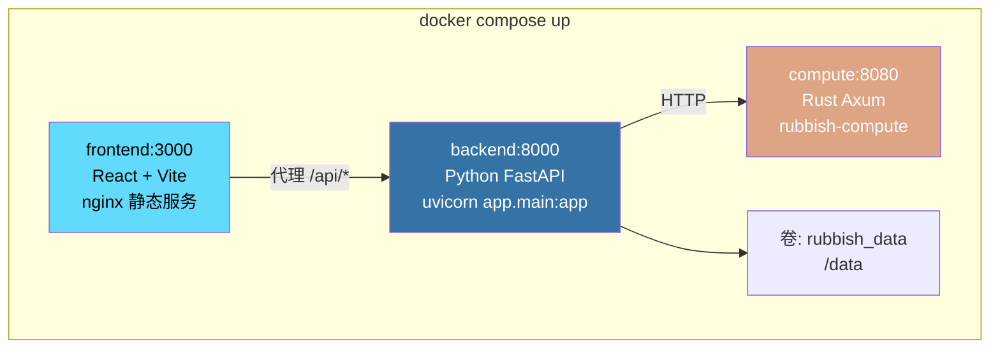
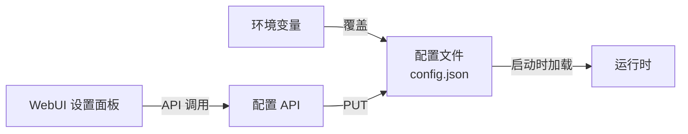

# 部署

## Docker Compose（开发环境）



```bash
# 启动所有服务
docker compose up -d --build

# 查看日志
docker compose logs -f

# 停止
docker compose down
```

## 生产构建

```bash
# 构建镜像
docker compose build

# 标记并推送
docker tag rubbish-backend:latest registry.example.com/rubbish-backend:latest
docker tag rubbish-compute:latest registry.example.com/rubbish-compute:latest
docker tag rubbish-webui:latest registry.example.com/rubbish-webui:latest
```

## 配置

所有运行时参数通过 `/api/v1/config` 的配置 API 暴露。



### 环境变量

| 变量 | 默认值 | 描述 |
| :--- | :--- | :--- |
| `DATABASE_URL` | `sqlite+aiosqlite:///data/rubbish.db` | 后端数据库 |
| `COMPUTE_NODE_URL` | `http://compute:8080` | Rust 计算节点地址 |
| `COMPUTE_DB_PATH` | `./data/codegraph.db` | 计算节点 SQLite 数据库路径（`:memory:` 用于测试） |
| `COMPUTE_PORT` | `8080` | 计算节点 HTTP 监听端口 |
| `LOG_LEVEL` | `INFO` | 日志级别 |

## 数据持久化

```
/data/
├── rubbish.db            # 主 SQLite（会话、检查点）
├── config.json           # 配置覆盖
├── offload/              # 卸载的大结果
│   ├── abc123.json
│   └── def456.json
└── compute/
    └── codegraph.db      # CodeGraph SQLite（节点、边、FTS5）
```

## 系统要求

| 组件 | CPU | 内存 | 磁盘 |
| :--- | :--- | :--- | :--- |
| 后端（Backend） | 1 核 | 1 GB | 1 GB |
| 计算节点（Compute） | 2 核 | 2 GB | 5 GB |
| 前端（Frontend） | 1 核 | 512 MB | 500 MB |
