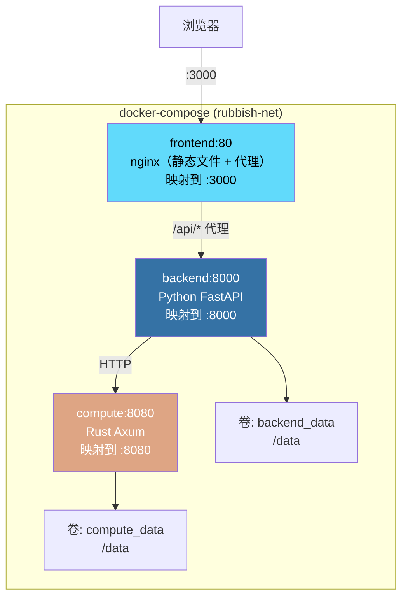

# 部署

## 架构



三个服务运行在专用的桥接网络（`rubbish-net`）中，通过 Docker 服务名（`backend`、`compute`、`frontend`）通信。仅映射的端口暴露给宿主机。

## 前置要求

- Docker 24+
- Docker Compose v2（Docker Desktop 已内置）

## 快速开始

```bash
# 1. 克隆并进入项目
cd rubbish

# 2. 复制 Docker 环境模板并配置
cp .env.docker .env
# 编辑 .env — 至少设置 LLM_API_KEY

# 3. 构建并启动所有服务
docker compose up --build -d

# 4. 打开 WebUI
open http://localhost:3000

# 5. 查看日志
docker compose logs -f

# 6. 停止所有服务
docker compose down
```

## 服务详情

### 后端（`backend:8000` → 宿主机 `:8000`）

- Python FastAPI + uvicorn
- 内部监听端口 **8000**
- 从 `.env` 文件和 `LLM_API_KEY` 环境变量读取配置
- 连接计算节点到 `http://compute:8080`
- 数据持久化到 `backend_data` 卷的 `/data` 目录：
  - 会话检查点
  - 配置覆盖（`config.json`）
  - 卸载的大结果
- 健康检查：每 30s，`GET /health`，15s 启动等待

### 计算节点（`compute:8080` → 宿主机 `:8080`）

- Rust Axum 微服务
- 内部监听端口 **8080**
- CodeGraph 数据存储在 `compute_data` 卷的 `/data/codegraph.db` 中
- 健康检查：每 30s，`GET /health`，15s 启动等待

### 前端（`frontend:80` → 宿主机 `:3000`）

- React SPA 构建为静态文件，由 **nginx** 提供服务
- 内部监听端口 **80**，映射到宿主机端口 **3000**
- Nginx 将所有 `/api/*` 请求代理到 `http://backend:8000/api/`
- 支持 **WebSocket**（工具权限对话框）和 **SSE**（流式响应）
- SPA 回退：所有非 API 路由服务 `index.html`
- 等待后端健康检查通过后才启动

## 环境变量

复制 `.env.docker` 为 `.env` 并配置：

| 变量 | 默认值 | 必填 | 描述 |
| :--- | :--- | :--- | :--- |
| `LLM_API_KEY` | — | **是** | LLM 提供商 API 密钥 |
| `LLM_BASE_URL` | `https://api.deepseek.com` | 否 | LLM API 基础 URL |
| `LLM_MODEL` | `deepseek-chat` | 否 | 模型名称 |
| `LLM_PROVIDER` | `openai` | 否 | 提供商类型（`openai` / `anthropic`） |
| `BACKEND_PORT` | `8000` | 否 | 后端宿主机端口 |
| `COMPUTE_PORT` | `8080` | 否 | 计算节点宿主机端口 |
| `FRONTEND_PORT` | `3000` | 否 | 前端宿主机端口 |

额外后端设置（可选）：

| 变量 | 默认值 | 描述 |
| :--- | :--- | :--- |
| `AGENT_MAX_TURNS` | `50` | 代理循环最大迭代次数 |
| `TOOL_SHELL_TIMEOUT` | `30` | Shell 命令超时秒数 |
| `LOG_LEVEL` | `INFO` | 日志级别 |

## 数据持久化

两个命名 Docker 卷存储持久数据：

```
backend_data:/data/
├── config.json              # 配置覆盖（通过 WebUI / API 设置）
├── offload/                 # 卸载的大工具结果
│   ├── abc123.json
│   └── def456.json
└── .sessions/               # 会话检查点（由 CheckpointManager 创建）

compute_data:/data/
└── codegraph.db             # CodeGraph SQLite（节点、边、FTS5 索引）
```

查看或备份卷：

```bash
# 列出卷
docker volume ls | grep rubbish

# 查看卷挂载点
docker volume inspect rubbish_backend_data

# 备份
docker run --rm -v rubbish_backend_data:/data -v .:/backup alpine \
    tar czf /backup/backend-data.tar.gz -C /data .
```

## 健康检查

所有服务包含 Docker 健康检查：

| 服务 | 命令 | 间隔 | 启动等待 | 重试 |
| :--- | :--- | :--- | :--- | :--- |
| backend | `GET /health`（通过 Python urllib） | 30s | 15s | 3 |
| compute | `GET /health`（通过 wget） | 30s | 15s | 3 |
| frontend | 依赖 `backend: condition: service_healthy` | — | — | — |

前端容器会等待后端健康检查通过后才启动。

## 生产环境注意事项

### 安全

- 后端以 **非 root 用户**（`app`，UID 1001）运行
- 计算节点仅导入最小依赖（无 shell 访问）
- 三个服务共享专用桥接网络 — 不暴露不必要的端口
- 敏感值（`LLM_API_KEY`）通过 `.env` 传递，不内置于镜像中

### 扩缩容

生产部署建议：

```bash
# 1. 在堆栈前使用反向代理（如 Caddy / Traefik）处理 TLS 终止和域名路由

# 2. 固定特定镜像版本而非从源码构建
docker compose build
docker tag rubbish-backend:latest registry.example.com/rubbish-backend:v1.0.0
docker push registry.example.com/rubbish-backend:v1.0.0
# 更新 docker-compose.yml 使用标记的镜像

# 3. 为 Docker 容器日志设置日志轮转

# 4. 定期安排卷备份
```

### 系统要求

| 组件 | CPU | 内存 | 磁盘 |
| :--- | :--- | :--- | :--- |
| 后端 | 1 核 | 1 GB | 1 GB |
| 计算节点 | 2 核 | 2 GB | 5 GB |
| 前端 | 1 核 | 512 MB | 500 MB |

## 故障排查

```bash
# 检查容器状态
docker compose ps

# 查看特定服务的日志
docker compose logs backend
docker compose logs -f compute

# 从零重新构建（无缓存）
docker compose build --no-cache

# 重置所有数据（⚠️ 删除卷）
docker compose down -v
```
