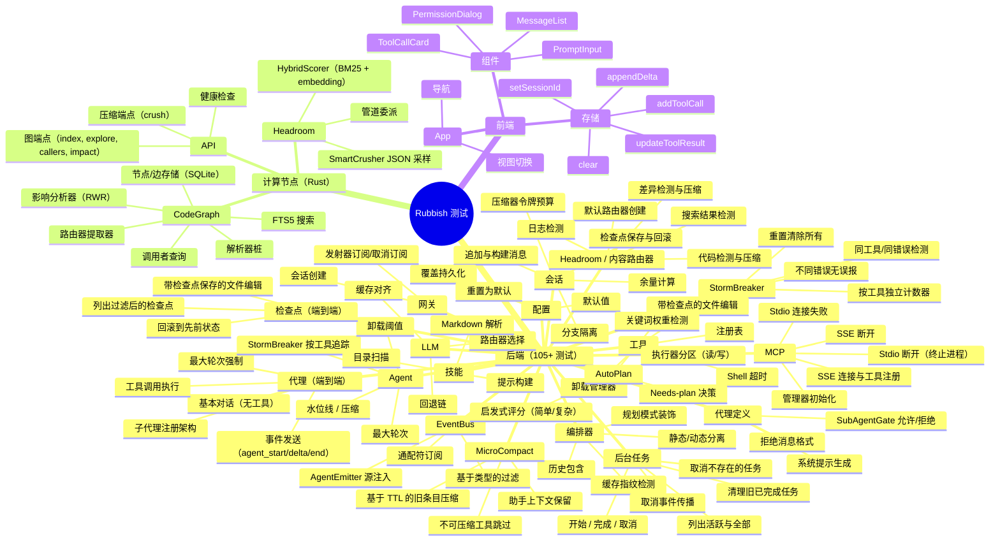

# 开发指南

## 前置要求

- Python 3.11+
- Rust 1.77+
- Node.js 20+
- Docker & Docker Compose（可选）

## 快速开始

```powershell
# 一条命令：启动所有 3 个服务（backend + compute + frontend）
.\run.ps1 all -Install

# 或单独启动：
.\run.ps1 backend
.\run.ps1 compute
.\run.ps1 frontend

# 优雅停止所有后台服务：
.\run.ps1 stop

# 运行所有单元测试：
.\runtests.ps1

# 运行集成测试（需要先构建 compute-node 二进制文件）：
.\runtests.ps1 -Integration
```

## 服务生命周期

### 启动

使用 `.\run.ps1 all` 以后台（静默）模式启动所有三个服务。每个服务的 PID 保存到 `run/<name>.pid` 以供后续清理。

使用 `.\run.ps1 all -Dev` 打开三个独立的终端窗口 — 便于查看每个服务的实时日志。PID 仍然会被跟踪，因此 `.\run.ps1 stop` 同样有效。

### 停止

运行 `.\run.ps1 stop` 以反向启动顺序（frontend → backend → compute）优雅停止所有后台服务：

1. 从 `run/<name>.pid` 读取每个 PID
2. 发送 `Stop-Process`（Windows 上为 WM_CLOSE）以优雅关闭
3. 等待最多 5 秒让进程退出
4. 如果仍在运行则强制终止
5. 清理 PID 文件

你也可以通过点击 WebUI 右上角导航栏中的电源图标来关闭后端，该操作会调用 `POST /api/v1/shutdown`。

## 服务开发

### 1. 后端（Backend）

```bash
cd backend
python -m venv .venv
.venv\Scripts\activate   # Windows
pip install -e .

# 运行测试
pytest tests/ -v

# 带覆盖率运行
pytest tests/ --cov=app --cov-report=term-missing

# 启动开发服务器
uvicorn app.main:app --reload --port 8000
```

### 2. 计算节点（Compute Node）

```bash
cd compute-node

# 构建
cargo build

# 运行测试
cargo test

# 启动（SQLite 默认持久化到 ./data/codegraph.db）
cargo run

# 自定义数据库路径
$env:COMPUTE_DB_PATH = "./my_data/graph.db"
cargo run
```

### 3. 前端（Frontend）

```bash
cd frontend
npm install

# 运行测试
npm test

# 启动开发服务器（带 API 代理到后端）
npm run dev
```

## 统一测试运行器

使用 [`runtests.ps1`](../runtests.ps1) 脚本一键运行所有测试套件：

```powershell
.\runtests.ps1                  # 运行所有单元测试：backend + compute-node + frontend
.\runtests.ps1 -Module backend  # 仅后端（pytest）
.\runtests.ps1 -Module compute-node  # 仅 Rust（cargo test）
.\runtests.ps1 -Module frontend # 仅前端（vitest）
```

## 集成测试

集成测试端到端验证 Python ↔ Rust HTTP 通信。它们将实际的 Rust 计算节点二进制文件作为子进程启动，并发出真实的 HTTP 请求。

**前置要求：**
```bash
cd compute-node
cargo build   # 先构建 Rust 二进制文件
```

**运行：**
```powershell
.\runtests.ps1 -Integration
# 或直接：
pytest backend/tests/test_integration_compute.py -v --timeout=60
```

**测试内容：**
- 健康检查端点
- 项目索引（`/graph/index`）
- 符号探索（`/graph/explore`）
- 调用者查询（`/graph/callers`）
- JSON 压缩（`/compress/crush`）
- 文本压缩
- 影响半径（`/graph/impact`）
- 数据库持久化（数据跨请求保持）

> 测试使用临时 SQLite 数据库和非标准端口（18080）以避免冲突。

## 测试覆盖率



## 代码风格

- **Python**：遵循 PEP 8，使用 `ruff` 进行 lint 检查
- **Rust**：遵循 `rustfmt` 默认配置
- **TypeScript**：使用严格模式，`prettier` 格式化

## 添加新可配置参数

1. 在 [`schema.py`](../backend/app/config/schema.py) 中添加字段
2. 在模块中通过 `from app.config import config` → `config.my_new_param` 使用
3. 该值自动通过配置 API 和面板暴露
4. 在 [`CONFIG.md`](CONFIG.md) 中记录

## 架构原则

1. **绝不使用 PyO3** — Rust 作为独立的 HTTP 微服务运行
2. **配置优先于魔数** — 所有可调参数通过 ConfigSchema/API 暴露
3. **SSE 用于流式传输，WebSocket 用于双向通信** — 清晰的责任分离
4. **读/写分区** — 读取工具并行运行（信号量），写入串行化（锁）
5. **缓存优先** — Compose 系统对齐系统提示字节以获得最大缓存命中率
