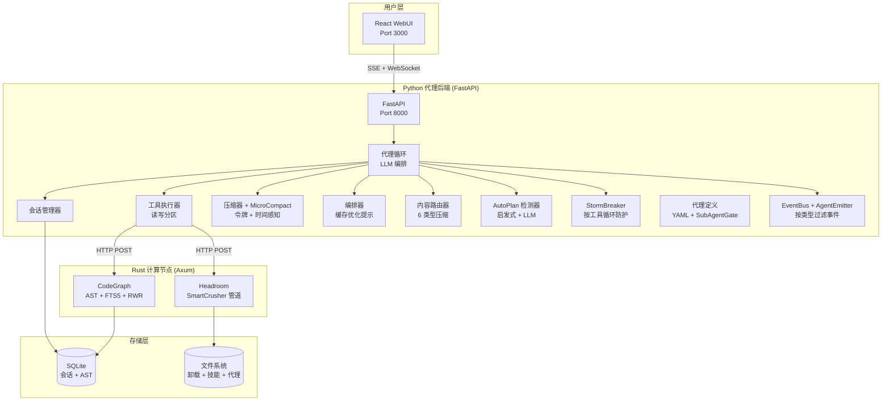

# Rubbish

> **智能代理驱动的代码分析引擎** — Python 编排器 + Rust 计算 + React WebUI。

Rubbish 是一个全栈多进程代理平台，结合了 LLM 编排（Python/FastAPI）、计算密集型代码分析（Rust/Axum）和现代 Web 界面（React/Vite）。

---

## 快速开始

### Docker（推荐）

```bash
cp .env.docker .env        # 配置 LLM_API_KEY
docker compose up --build -d
open http://localhost:3000
```

### 本地开发（Windows）

```powershell
.\run.ps1 all -Install     # 后台启动所有 3 个服务
.\run.ps1 stop             # 优雅停止所有服务
```

## 架构概览



## 文档

| 指南 | English | 中文 |
| :--- | :--- | :--- |
| 架构 | [ARCHITECTURE.md](../ARCHITECTURE.md) | [ARCHITECTURE.md](ARCHITECTURE.md) |
| API 参考 | [API.md](../API.md) | [API.md](API.md) |
| 配置 | [CONFIG.md](../CONFIG.md) | [CONFIG.md](CONFIG.md) |
| 部署 | [DEPLOYMENT.md](../DEPLOYMENT.md) | [DEPLOYMENT.md](DEPLOYMENT.md) |
| 开发 | [DEVELOPMENT.md](../DEVELOPMENT.md) | [DEVELOPMENT.md](DEVELOPMENT.md) |

## 项目结构

```
rubbish/
├── backend/              # Python FastAPI — 代理编排
│   ├── app/
│   │   ├── core/         # 代理、网关、StormBreaker、EventBus
│   │   ├── llm/          # LLM 提供商、编排器、回退
│   │   ├── session/      # 会话、压缩器、MicroCompact、Checkpoint
│   │   ├── tools/        # 工具注册表、执行器、内置工具、卸载
│   │   ├── headroom/     # 内容路由器（6 类型压缩）
│   │   ├── autoplan/     # 启发式 + LLM 规划检测
│   │   ├── agentdef/     # 代理定义系统 + SubAgentGate
│   │   ├── workspace/    # 工作区管理器（打开/关闭/切换/最近）
│   │   ├── config/       # ConfigSchema（集中配置）
│   │   ├── api/          # REST 路由 + WebSocket
│   │   └── skills/       # 技能加载器
│   └── tests/            # 105+ pytest 测试
├── compute-node/         # Rust Axum — 代码分析与压缩
├── frontend/             # React + Vite — WebUI
├── docs/                 # 文档
│   └── zh-CN/            # 中文文档
├── .env.docker           # Docker 环境变量模板
├── docker-compose.yml    # Docker Compose 配置
├── run.ps1               # 统一运行入口
└── runtests.ps1          # 统一测试运行器
```

## 脚本

| 脚本 | 用途 | 示例 |
| :--- | :--- | :--- |
| [`run.ps1`](../run.ps1) | 启动/停止服务 | `.\run.ps1 backend`, `.\run.ps1 all`, `.\run.ps1 stop` |
| [`runtests.ps1`](../runtests.ps1) | 运行全部/模块测试 | `.\runtests.ps1`, `.\runtests.ps1 -Module backend` |

## 许可

MIT
