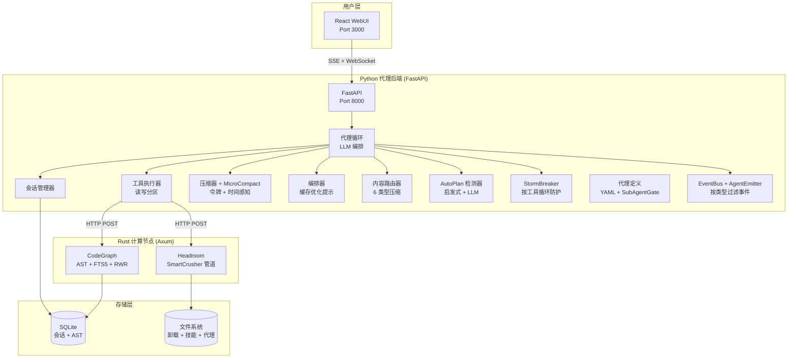

# Rubbish

> **智能代理驱动的代码分析引擎** — Python 编排器 + Rust 计算 + React WebUI。

Rubbish 是一个全栈多进程代理平台，结合了 LLM 编排（Python/FastAPI）、计算密集型代码分析（Rust/Axum）和现代 Web 界面（React/Vite）。

---

## 快速开始

```bash
# 方式 A：通过 Docker 启动完整栈
docker compose up -d
open http://localhost:3000

# 方式 B：单独启动各服务（开发模式）
.\run.ps1 backend       # FastAPI on :8000
.\run.ps1 frontend      # Vite on :5173
.\run.ps1 compute       # Rust on :8080
.\run.ps1 all           # 后台启动 backend + compute + frontend
.\run.ps1 all -Dev      # 同上，但分别打开独立终端窗口
.\run.ps1 stop          # 优雅停止所有后台服务
```

## 架构概览



## 核心设计模式

| 模式 | 模块 | 描述 |
| :--- | :--- | :--- |
| **MicroCompact** | `session/microcompact.py` | 时间感知压缩，与 Anthropic 5 分钟提示缓存 TTL 对齐 |
| **Compose** | `llm/composer.py` | 缓存优化的提示：系统提示保持静态，可变内容装饰用户消息尾部 |
| **StormBreaker** | `core/stormbreaker.py` | 按工具的 `(名称, 错误)` 键追踪；成功仅重置自身计数器 |
| **Content Router** | `headroom/router.py` | 检测器链（Diff→Code→Log→Search→Command→Text）将内容路由到最优压缩器 |
| **AutoPlan** | `autoplan/detector.py` | 两阶段：低成本启发式评分（0-4），仅边界情况调用 LLM 分类器（3s 超时） |
| **Workspace** | `workspace/__init__.py` | 追踪当前和最近的工作区目录；持久化到磁盘；API 优先 |
| **Shutdown** | `main.py` + `run.ps1` | 双路径：后端 `/api/v1/shutdown` 端点 + `.\run.ps1 stop` 的 PID 文件追踪 |
| **AgentEmitter** | `core/emitter.py` | 自动向事件注入 `source` 字段；`subscribe(kind)` 支持按类型过滤 |
| **SubAgentGate** | `agentdef/loader.py` | 运行时工具访问门 — 不修改工具列表，在执行时拒绝以保持缓存 |
| **Checkpoint** | `session/checkpoint.py` | 每轮独立的 JSON 文件（`turn-N.json`），路径转义保护，幂等恢复 |

## 项目结构

```
rubbish/
├── backend/              # Python FastAPI — 代理编排
│   ├── app/
│   │   ├── core/         # 代理、网关、StormBreaker、EventBus
│   │   ├── llm/          # LLM 提供商、编排器、回退
│   │   ├── session/      # 会话、压缩器、MicroCompact、Checkpoint
│   │   ├── tools/        # 工具注册表、执行器、内置工具、卸载
│   │   ├── headroom/     # 内容路由器（6 类型压缩）
│   │   ├── autoplan/     # 启发式 + LLM 规划检测
│   │   ├── agentdef/     # 代理定义系统 + SubAgentGate
│   │   ├── workspace/    # 工作区管理器（打开/关闭/切换/最近）
│   │   ├── config/       # ConfigSchema（集中配置）
│   │   ├── api/          # REST 路由 + WebSocket
│   │   └── skills/       # 技能加载器
│   └── tests/            # 76+ pytest 测试
├── compute-node/         # Rust Axum — 代码分析与压缩
├── frontend/             # React + Vite — WebUI
├── docs/                 # 文档
│   └── zh-CN/            # 中文文档
├── run.ps1               # 统一运行入口
└── runtests.ps1          # 统一测试运行器
```

## 脚本

| 脚本 | 用途 | 示例 |
| :--- | :--- | :--- |
| [`run.ps1`](../run.ps1) | 启动/停止服务 | `.\run.ps1 backend`, `.\run.ps1 all -Install`, `.\run.ps1 stop` |
| [`runtests.ps1`](../runtests.ps1) | 运行全部/模块测试 | `.\runtests.ps1`, `.\runtests.ps1 -Module backend` |

## 许可

MIT
